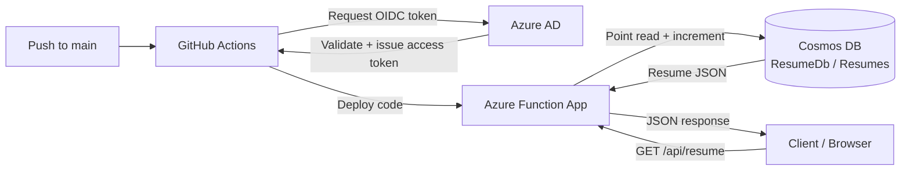

# Azure Resume API

A serverless resume API built on Azure, submitted for the [Cloud Resume API Challenge — Azure track](https://cloudresumeapi.dev/azure/) by [Rishab Kumar](https://github.com/rishabkumar7). This implementation uses **Azure Functions + Cosmos DB**, deployed automatically via GitHub Actions using OIDC (no stored secrets).

## Live Endpoint

```
GET https://func-resume-nitin-agb8gnafa9h8ggfd.centralindia-01.azurewebsites.net/api/resume
```

Each request returns my resume as JSON (in [JSON Resume](https://jsonresume.org/schema/) format) and increments a `visitor_count` field.

## Architecture



**CI/CD path:** every push to `main` triggers the GitHub Actions workflow, which authenticates to Azure via OpenID Connect (federated identity — no passwords or long-lived secrets stored in GitHub), then deploys the built Function App.

**Request path:** a client hits `/api/resume` → the Function performs a Cosmos DB point read (by `id` + partition key `/id`) → increments `visitor_count` → writes the document back → returns the updated JSON.

| Component | Azure Service | Purpose |
|---|---|---|
| Data storage | Azure Cosmos DB (Core/SQL API, free tier) | Stores the resume as a single JSON document |
| API | Azure Functions (.NET 8, isolated worker model) | HTTP-triggered endpoint that reads the document and increments the visitor count |
| CI/CD | GitHub Actions + OIDC | Builds and deploys the Function App automatically on every push to `main`, authenticating via Azure AD federated credentials instead of stored secrets |

## Prerequisites (for local development)

- [.NET 8 SDK](https://dotnet.microsoft.com/download)
- [Azure Functions Core Tools v4](https://learn.microsoft.com/azure/azure-functions/functions-run-local)
- An Azure Cosmos DB account (Core/SQL API) with:
  - Database: `ResumeDb`
  - Container: `Resumes`
  - Partition key: `/id`

## Running Locally

```bash
# Clone the repo
git clone https://github.com/nitinjaswal/azure-resume-api.git
cd azure-resume-api

# Restore dependencies
dotnet restore
```

Create a `local.settings.json` file in the project root (this file is git-ignored and never committed, since it holds secrets):

```json
{
  "IsEncrypted": false,
  "Values": {
    "AzureWebJobsStorage": "UseDevelopmentStorage=true",
    "FUNCTIONS_WORKER_RUNTIME": "dotnet-isolated",
    "CosmosDbConnectionString": "<your-cosmos-db-connection-string>"
  }
}
```

Run the function:

```bash
func start
```

The API will be available at `http://localhost:7071/api/resume`.

## Testing the API

**Browser:** open `http://localhost:7071/api/resume` (or the live URL above) directly — the endpoint returns JSON, so it renders as text in the browser.

**curl:**
```bash
curl https://func-resume-nitin-agb8gnafa9h8ggfd.centralindia-01.azurewebsites.net/api/resume
```

**Expected response shape:**
```json
{
  "id": "1",
  "name": "Nitin Jaswal",
  "label": "Senior Software Engineer",
  "email": "...",
  "experience": [ ... ],
  "skills": { ... },
  "visitor_count": 42
}
```

Each successive call increments `visitor_count` by 1 — a quick way to confirm both the read and write paths work end to end.

## Deployment (CI/CD)

Deployment is fully automated via `.github/workflows/deploy.yml`. On every push to `main`:

1. GitHub Actions checks out the code and builds it (`dotnet build`)
2. The workflow requests a short-lived OIDC token from GitHub's token service
3. Azure AD validates that token against a federated credential scoped to this exact repo and branch, then issues a temporary Azure access token
4. The built package is deployed to the Function App using that token

No Azure credentials, passwords, or publish profiles are stored in GitHub — only three non-secret identifiers (`AZURE_CLIENT_ID`, `AZURE_TENANT_ID`, `AZURE_SUBSCRIPTION_ID`), which identify *which* Azure identity to use but cannot themselves be used to authenticate as that identity.

**Manual deployment (fallback):**
```bash
func azure functionapp publish func-resume-nitin
```

## Design Decisions

A few deliberate choices worth calling out:

- **JSON Resume schema** — used the existing open [JSON Resume](https://jsonresume.org/schema/) standard for the document shape instead of inventing a custom one.
- **Partition key `/id`** — for a single-document, low-traffic API, partitioning doesn't meaningfully affect performance. `/id` was chosen because it's a sensible, defensible default when there's no real scaling requirement to design around.
- **Visitor count via simple read-then-write** — deliberately skipped optimistic concurrency (ETags) or a stored procedure for the increment, since expected traffic (a handful of views a day) makes the race-condition risk negligible. Documented here as a conscious trade-off, not an oversight.
- **Typed C# model instead of `dynamic`** — reading into a strongly-typed `Resume` class (rather than deserializing into `dynamic`) keeps Cosmos DB's internal system properties (`_rid`, `_etag`, `_ts`, etc.) out of the public API response.
- **OIDC over publish profile** — chose federated identity authentication for CI/CD instead of the simpler publish-profile method, to avoid storing any long-lived deployment credential in GitHub.

## Tech Stack

- .NET 8 (Azure Functions isolated worker model)
- Azure Cosmos DB (Core/SQL API)
- Azure Functions (Consumption plan)
- GitHub Actions (OIDC-based CI/CD)

## Reference

Built as a submission to the [Cloud Resume API Challenge — Azure track](https://cloudresumeapi.dev/azure/), created by [Rishab Kumar](https://github.com/rishabkumar7). The challenge description and requirements this project follows are documented there.

## Author

**Nitin Jaswal** — Senior Software Engineer
[LinkedIn](https://www.linkedin.com/in/nitin-jaswal)
